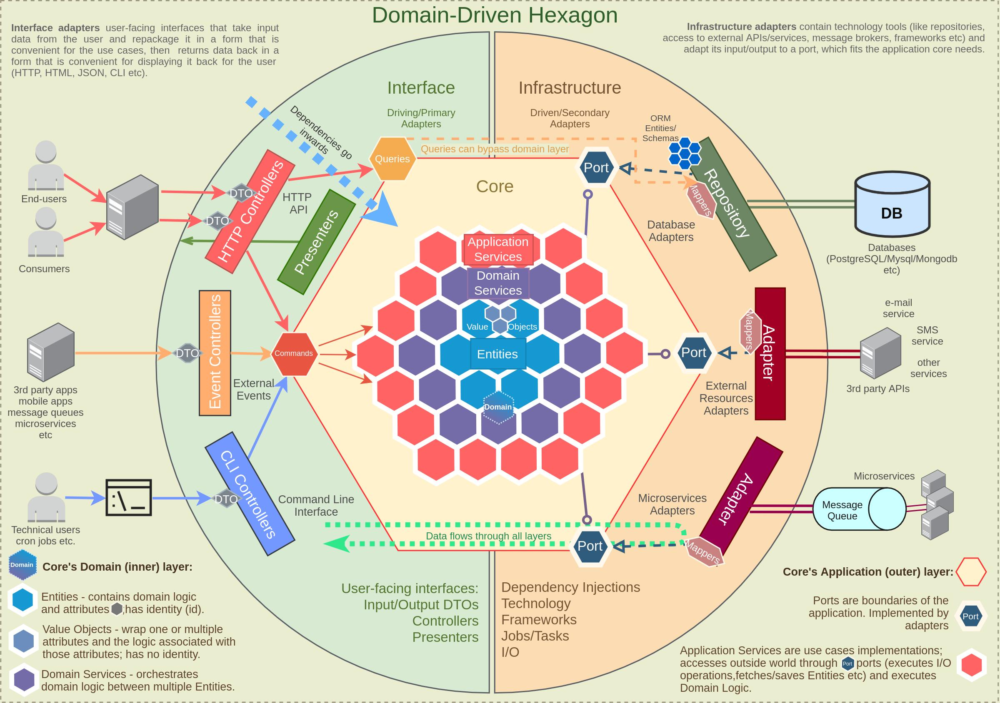

# Arquitetura Hexagonal

## Objetivo
A arquitetura hexagonal, proposta por Alistair Cockburn, tem como objetivo principal criar sistemas de software fracamente acoplados, permitindo que seus componentes sejam testados de forma independente. Essa abordagem facilita a substituição de partes do sistema, como interfaces de usuário ou bancos de dados, sem impactar a lógica de negócio. Além disso, promove uma separação clara entre a lógica central do aplicativo e suas interações externas, resultando em maior flexibilidade, manutenibilidade e adaptabilidade às mudanças nos requisitos.

## Benefícios e Cuidados

### Benefícios
1. **Desacoplamento**: Permite separar a lógica de negócios da infraestrutura, facilitando a criação de componentes testáveis e independentes.
2. **Reutilização de Lógica de Domínio**: Vários tipos de clientes podem acessar a mesma lógica de domínio, promovendo a reutilização e a consistência.
3. **Flexibilidade Tecnológica**: Atualizações em componentes de interface de usuário e banco de dados podem ser realizadas sem impactar a lógica de negócios, aumentando a adaptabilidade do sistema.
4. **Suporte a Múltiplos Provedores**: Facilita a integração com diversos provedores de entrada e consumidores de saída, tornando o código mais extensível e menos complexo.
5. **Melhor Testabilidade**: O uso de abstrações para entradas e saídas simplifica a criação de testes unitários, permitindo testar componentes de forma isolada.

### Cuidados
1. **Complexidade de Design**: Separar a lógica de negócios do código de infraestrutura pode aumentar a complexidade. É essencial planejar cuidadosamente para evitar problemas de manutenção.
2. **Sobrecarga de Manutenção**: A implementação de adaptadores para conectar diferentes partes da aplicação pode introduzir uma sobrecarga adicional. Essa camada extra é justificada apenas se houver necessidade real de múltiplas fontes de entrada e destinos de saída.
3. **Latência**: A introdução de portas e adaptadores pode resultar em latência, pois adiciona uma camada extra de comunicação. É importante monitorar e otimizar o desempenho do sistema.
4. **Design Orientado a Domínio (DDD)**: A arquitetura hexagonal é especialmente eficaz quando usada em conjunto com DDD. Cada componente deve representar um subdomínio para evitar acoplamento excessivo.

## Componentes

### Domínio
É o núcleo da aplicação, onde a lógica de negócios e as regras do domínio são implementadas. É independente de camadas externas e mudanças em componentes como bancos de dados ou APIs. O foco principal é resolver problemas do negócio e garantir a correta aplicação das regras do domínio.

### Ports
São interfaces que definem como o núcleo da aplicação (domínio) se comunica com o mundo externo. Elas atuam como contratos que garantem que o domínio permaneça desacoplado das implementações específicas. Existem dois tipos principais de ports:
- **Driving Ports (Ports de Entrada / Inbound Ports)**: Estas interfaces permitem que componentes externos interajam com a lógica de negócios. Elas definem os serviços que o sistema oferece ao mundo exterior, permitindo, por exemplo, que uma interface de usuário ou uma API receba dados e comandos.
- **Driven Ports (Ports de Saída / Outbound Ports)**: Estas interfaces são utilizadas pelo domínio para interagir com serviços externos, como bancos de dados ou APIs de terceiros. Elas garantem que o domínio permaneça isolado de detalhes de infraestrutura.

### Adapters
São implementações concretas que conectam as ports e facilitam a comunicação entre o domínio e os sistemas externos. Existem dois tipos principais de adapters:
- **Adapters Primários (Driving Adapters / Adapters de Entrada)**: Esses adapters recebem chamadas de métodos de sistemas externos e as direcionam para os métodos apropriados dos driving ports.
- **Adapters Secundários (Driven Adapters / Adapters de Saída)**: Esses adapters recebem chamadas do domínio e as encaminham para sistemas externos, permitindo ao domínio interagir com o mundo exterior.

## Componentes Extras

### Use Case
- **Definição**: Um use case (ou caso de uso) descreve uma interação específica entre um usuário (ou outro sistema) e a aplicação, detalhando um cenário particular que gera valor.
- **Exemplo**: Um use case pode ser "Registrar um novo usuário", que detalha os passos a seguir, as validações necessárias e as respostas que a aplicação deve fornecer ao usuário.

### Handlers
- **Definição**: Handlers são componentes que recebem solicitações externas e as traduzem em ações que podem ser executadas pela lógica de negócio. Eles conectam a camada externa com o domínio.
- **Exemplo**: Um handler pode processar uma requisição para criar um novo usuário, convertendo os dados recebidos em um comando que será enviado ao use case responsável pelo registro.

## Relação Entre os Conceitos
1. **Domínio**: Define o "o que" e "como" da lógica de negócio, incluindo regras e entidades.
2. **Use Cases**: Derivam do domínio e descrevem "quem" faz o quê e "qual" é o resultado esperado em cenários específicos.
3. **Handlers**: Traduzem as interações externas em comandos que podem acionar use cases, conectando a aplicação ao mundo externo.
### Explicação
- **Domínio**: Conjunto de regras e conceitos do problema a ser resolvido.
- **Use Cases**: Cenários específicos de interação do usuário com a aplicação, fundamentados nas regras do domínio.
- **Handlers**: Responsáveis por processar as solicitações externas e interagir com os use cases para executar a lógica de negócio.

## Referências
- [AWS: Hexagonal Architecture](https://docs.aws.amazon.com/pt_br/prescriptive-guidance/latest/cloud-design-patterns/hexagonal-architecture.html)
- [Gran Cursos: Arquitetura Hexagonal](https://blog.grancursosonline.com.br/arquitetura-hexagonal-desacoplando-e-facilitando-a-manutencao-de-sistemas/)
